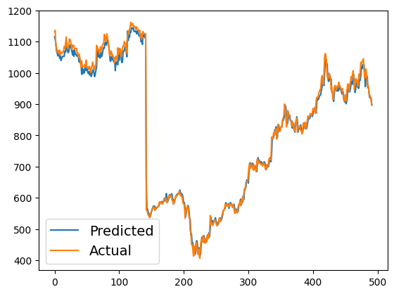

# LSTM-Based Stock Predictor 📈

This repository contains an **LSTM-based Stock Predictor**, designed to analyze stock trends and deliver **highly accurate long-term predictions**. While short-term forecasts are challenging due to market volatility, this model leverages the strengths of Long Short-Term Memory (LSTM) networks to identify and predict patterns over extended periods.

---

## 📋 Index

1. [Dataset](#dataset)
2. [Results](#results)
3. [Model Architecture](#model-architecture)
4. [Future Scope](#future-scope)
---

## 📈 Dataset

The model was trained and evaluated using the **NIFTY-50 Stock Market Data (2000 - 2021)**, specifically HCLTECH ,  which provides features such as:
- **Open**: Opening price of the stock
- **Low**: Lowest price during the trading day
- **Previous Close**: Closing price of the stock
---

## 📊 Results

### 1. **Model Performance**
- The LSTM model demonstrates **strong accuracy for long-term predictions**  Below is a sample result:

  

### 2. **Evaluation Metrics**
| Metric                 | Value              |
|------------------------|--------------------|
| **RMSE**               | 17.5266            | 
| **MAE**                | 13.138             |

## 🧠 Model Architecture

The LSTM-based stock predictor is designed with a combination of **Bidirectional RNNs** and **GRUs**, making it suitable for capturing sequential dependencies in stock price data. Below is a breakdown of the model's layers and configuration:

---

### Model Summary

| **Layer (Type)**                  | **Output Shape**        | **Parameters**     |
|-----------------------------------|-------------------------|--------------------|
| `input_layer_5` (InputLayer)      | `(None, 2, 1)`          | 0                  |
| `bidirectional_6` (Bidirectional) | `(None, 2, 128)`        | 33,792             |
| `gru_6` (GRU)                     | `(None, 32)`            | 15,552             |
| `dense_12` (Dense)                | `(None, 64)`            | 2,112              |
| `dense_13` (Dense)                | `(None, 1)`             | 65                 |

---

### Key Components

1. **Input Layer**:
   - Accepts a 3D tensor of shape `(batch_size, time_steps, features)` corresponding to the input data.
   - Here, `time_steps=2` and `features=1` represent the historical stock data.

2. **Bidirectional Layer**:
   - **Layer Type**: Bidirectional RNN.
   - Combines outputs from both forward and backward RNNs for better context comprehension.
   - Parameters: 33,792.

3. **GRU Layer**:
   - **Layer Type**: Gated Recurrent Unit (GRU).
   - Captures sequential patterns and dependencies in time-series data.
   - Output Shape: `(None, 32)`.
   - Parameters: 15,552.

4. **Dense Layers**:
   - `dense_12`: Fully connected layer with 64 neurons, helping the model learn complex patterns. Parameters: 2,112.
   - `dense_13`: Final output layer with 1 neuron for stock price prediction. Parameters: 65.

---

### Total Parameters

- **Total Parameters**: 51,521
---

### Architecture Flowchart

```plaintext
Input Layer (None, 2, 1)
        ↓
Bidirectional RNN (128 units)
        ↓
GRU (32 units)
        ↓
Dense Layer (64 neurons)
        ↓
Output Layer (1 neuron)
```
## 🔮 Future Scope

The project holds significant potential for improvement and expansion. Below are the key areas for future work:

1. **Incorporating More Features**:
   - Include external factors such as news sentiment analysis, economic indicators, or global events to enhance predictive accuracy.
   - Use features like **technical indicators** (e.g., RSI, MACD) to capture market behavior more effectively.

2. **Multi-Timeframe Analysis**:
   - Extend the model to analyze and predict stock prices across multiple timeframes (e.g., intraday, weekly, monthly) for broader applicability.

3. **Hybrid Models**:
   - Combine LSTM with **Convolutional Neural Networks (CNN)** to extract spatial features from historical data.
   - Explore **Transformer-based architectures** like BERT or GPT for better long-term sequence modeling.

4. **Explainable AI (XAI)**:
   - Implement techniques to interpret the model’s predictions, helping users understand the factors influencing its decisions.
   - Use tools like SHAP or LIME to visualize feature importance.

5. **Transfer Learning**:
   - Pre-train the model on larger, generalized financial datasets and fine-tune it for specific stock indices or sectors.

6. **Real-Time Prediction**:
   - Deploy the model for real-time forecasting by integrating it with live stock market data streams via APIs like **Yahoo Finance** or **Alpha Vantage**.

7. **Risk Prediction**:
   - Enhance the model to assess market risks, predict volatility, or recommend optimal trading strategies.

8. **Optimization Techniques**:
   - Experiment with advanced optimization methods, such as **AdamW** or **Ranger**, for improved convergence.
   - Use techniques like **Bayesian Optimization** or **Grid Search** to optimize hyperparameters automatically.

9. **Integration with Portfolio Management Systems**:
   - Extend the model to suggest buy/sell/hold strategies based on predictions.
   - Incorporate algorithms for **asset allocation** and **portfolio diversification**.

10. **Generalization to Other Financial Domains**:
    - Adapt the architecture to predict **cryptocurrency prices**, **commodity prices**, or **forex trends**.

